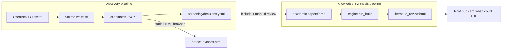

# EdTech–AI research discovery system (design)

**Status:** design-first prototype (September 2026).  
**Scope:** metadata discovery and human screening—**not** automatic evidence synthesis.

This document defines how EdTech–AI differs from SB-CPD and Climate & Education: curated manual summaries remain the only path into Knowledge Synthesis; discovery retrieves **candidates** from a strict journal/series whitelist.

---

## 1. Relationship to the existing hub

### Current architecture (unchanged for other areas)

| Layer | Mechanism | EdTech–AI today |
|--------|-----------|-----------------|
| Root dashboard | `scripts/literature_review/hub_root.py` + `html_renderer.build_root_html()` | Thematic card **0 papers**, non-link (`html_relative_from_dashboard=""`) |
| Area synthesis HTML | `scripts/literature_review/engine.py` → `discover_summaries()` scans `academic-papers/**/*.md` with numbered folders | No summaries → no area build in `AREA_FACTORIES` |
| Paper truth | Markdown summaries + `references.bib` | Empty evidence base |

`scripts/build_literature_review.py --area all` only builds **sb-cpd** and **climate-education**; it regenerates `dashboard/index.html` without counting discovery candidates.

### Design principle: two pipelines



- **Discovery refresh** may overwrite `discovery/data/*.json` (API fields only).
- **Screening** and **reviewed summaries** live in separate files; refresh must merge, not clobber, human decisions.

---

## 2. Research scope (two tracks)

Configured in `edtech-ai/config/tracks.yaml` (JSON mirror: `tracks.json`).

| Track ID | Label | Focus |
|----------|--------|--------|
| `teachers_and_ai` | Track A: Teachers and AI | Teacher use of AI/GenAI, lesson planning, instructional practice, PD and AI literacy |
| `ai_learning_outcomes` | Track B: AI and learning outcomes | ITS/adaptive learning, GenAI and student learning, achievement outcomes; causal designs when described in text (no RCT keyword gate at discovery) |

Tracks are stored on each candidate as `discovery_track_ids[]` and drive OpenAlex `search` strings plus **relevance_flags** (keyword groups)—not effect sizes or causal claims.

---

## 3. Source whitelist

**Canonical file:** `edtech-ai/config/sources.yaml`  
**Runtime mirror (optional):** `edtech-ai/config/sources.json` for stdlib-only scripts.

### Matching rules (strict)

1. Eligibility uses **OpenAlex `primary_location.source.id`** and/or **`issn_l`** equal to the whitelist entry.
2. No journal-title substring matching alone.
3. If API metadata cannot confirm the source, the record is **rejected** (not exported as eligible).
4. Nature and The Lancet: **main journal only** (explicit OpenAlex source ids; no sibling journals).
5. NBER and IZA: **working-paper series** (not peer-reviewed journals); record **version_relationships** when OpenAlex lists alternate locations or related works (WP ↔ journal).
6. **No other** journals, families, conferences, or series are whitelisted unless explicitly added to `sources.yaml`.

### A. Education, comparative education, and development

| Label | Canonical name | ISSN-L | OpenAlex id | Enabled |
|-------|----------------|--------|-------------|---------|
| IJER | International Journal of Educational Research | 0883-0355 | S156367897 | yes |
| IJED | International Journal of Educational Development | 0738-0593 | S20152851 | yes |
| JREE | Journal of Research on Educational Effectiveness | 1934-5739 | S163858705 | yes |
| EER | Economics of Education Review | 0272-7757 | S4888523 | yes |
| Compare | Compare: A Journal of Comparative and International Education | 0305-7925 | S129145296 | yes |
| CER | Comparative Education Review | 0010-4086 | S168329810 | yes |
| EDCC | Economic Development and Cultural Change | 0013-0079 | S71670289 | yes |
| World Development | World Development | 0305-750X | S85457386 | yes |

### B. Economics and policy evaluation

| Label | Canonical name | ISSN-L | OpenAlex id | Enabled |
|-------|----------------|--------|-------------|---------|
| AER | American Economic Review | 0002-8282 | S23254222 | yes |
| AEJ:Policy | American Economic Journal Economic Policy | 1945-7731 | S158011328 | yes |
| AEJ:Applied | American Economic Journal Applied Economics | 1945-7782 | S42893225 | yes |
| JDE | Journal of Development Economics | 0304-3878 | S101209419 | yes |
| JPE | Journal of Political Economy | 0022-3808 | S95323914 | yes |
| QJE | The Quarterly Journal of Economics | 0033-5533 | S203860005 | yes |

### C. General science and medicine (main journals only)

| Label | Canonical name | ISSN-L | OpenAlex id | Enabled |
|-------|----------------|--------|-------------|---------|
| Nature | Nature | 0028-0836 | S137773608 | yes |
| The Lancet | The Lancet | 0099-5355 | S49861241 | yes |

### D. Working-paper series

| Label | Canonical name | ISSN-L | OpenAlex id | Enabled |
|-------|----------------|--------|-------------|---------|
| NBER | NBER working paper series | 0898-2937 | S4393916240 | yes |
| IZA | IZA Discussion Papers | — | — | **no** |

Full notes (homonym exclusions, DOI prefixes) are in `sources.yaml`. Verified via OpenAlex Sources API, 2026-09-23.

### Unresolved (disabled)

| Label | Issue |
|-------|--------|
| **IZA** | **Future integration task:** no verified OpenAlex **source id** or ISSN-L for **IZA Discussion Papers** only (2026-09-23). Do not substitute IZA-branded journals. Discovery runs without IZA until a reliable identification/retrieval method is established. |

---

## 4. Discovery pipeline

### Stages

1. **Query** — OpenAlex `works` with filters: `primary_location.source.id`, **`from_publication_date` / `to_publication_date`** (publication dates, not citation/index dates), plus track-specific `search` (see `tracks.yaml`).
2. **Retrieve** — Title, authors, venue, DOI, OpenAlex id, abstract (inverted index), landing URL, OA flag, **`retrieved_at`** (search time) separate from **`work.publication.initial_publication_date`**.
3. **Whitelist validate** — Re-check `primary_location.source` against enabled entries.
4. **Deduplicate** — By normalized DOI; fallback OpenAlex work id (`record_id` in schema).
5. **Relevance flags** — Keyword groups per track (transparent; stored as `relevance_flags[]`).
6. **Export** — JSON bundle for screening (`discovery/data/`, gitignored by default).
7. **Screen** — Researcher edits `discovery/screening/decisions.yaml` (`include` / `exclude` + notes).
8. **Review** — Only after full read: add `academic-papers/.../*.md` summary → existing `run_build` path → `review_state: reviewed`.

### Review states

| State | Meaning | Counted on root dashboard? |
|-------|---------|----------------------------|
| `candidate` | API metadata only | **No** |
| `screened` | Human decision recorded | **No** |
| `reviewed` | Markdown summary exists; in synthesis build | **Yes** (via `discover_summaries` only) |

### Publication date window (10-year rolling default)

Configured in `edtech-ai/config/discovery.yaml` (JSON mirror: `discovery.json`).

| Rule | Implementation |
|------|----------------|
| Default span | **Search execution date minus 10 years** through **search execution date** (inclusive), same rule for journals and working-paper series |
| Date field | OpenAlex **`publication_date`** filters and record fields — **not** `created_date` / `updated_date` (metadata index times) |
| Window anchor | **Initial publication date** (earliest known among OpenAlex publication + location dates) |
| Revisions | Store **`latest_revision_date`** when later than initial; **do not** use revision date to satisfy the window |
| Reproducibility | `--search-date 2026-09-23` (rolling end) or fixed `--from-date 2016-09-23 --to-date 2026-09-23` |
| Foundational pre-window papers | **`discovery/screening/foundational_exceptions.yaml`** only — label `foundational_exception: true` + **justification**; never auto-fetched |

Initial September 2026 reference: **2016-09-23 → 2026-09-23** when `--search-date 2026-09-23`.

Bundle metadata (`search.publication_window` + `search.executed_at`) is written to `candidates_openalex.json` and surfaced on **`edtech-ai/index.html`** via `build_discovery_html.py`.

---

## 5. API selection and limitations

### Primary: OpenAlex

- **Terms:** [OpenAlex terms](https://openalex.org/about); polite pool with `mailto=` recommended.
- **Rate limits:** ~10 req/s without key; `$0.0001` per call above free tier (see API `cost_usd` in responses).
- **Strengths:** Single filter on `primary_location.source.id`; good journal coverage; DOI + abstract inverted index.
- **Limits:** Abstracts often missing; working-paper series coverage uneven (NBER partially typed as “journal”); full-text search quality varies; no substitute for reading PDFs.

### Secondary: Crossref (future)

- Use for DOI verification, ISSN confirmation, and filling gaps when OpenAlex lacks a record.
- Journal search alone is **insufficient** for whitelist enforcement (too many homonyms).

### Explicitly out of scope

- Publisher scraping, PDF download, paywalled full text.
- Live API calls from static HTML in the browser.
- LLM-generated “summaries” or effect estimates from titles/abstracts.

### Prototype script

`scripts/edtech_ai_discovery/fetch_candidates.py`

```bash
# Reproducible September 2026 window (one source):
python3 scripts/edtech_ai_discovery/fetch_candidates.py --search-date 2026-09-23 --source IJER --max-per-query 2 --mailto you@example.com --write-html

# Fixed window (explicit dates):
python3 scripts/edtech_ai_discovery/fetch_candidates.py --from-date 2016-09-23 --to-date 2026-09-23 --search-date 2026-09-23 --max-per-query 3 --mailto you@example.com

# Regenerate discovery landing page only:
python3 scripts/edtech_ai_discovery/build_discovery_html.py
```

Output: `edtech-ai/discovery/data/candidates_openalex.json` (unscreened; not evidence).

**Prototype tested (2026-09-23):** OpenAlex query with IJER source id + search string returned eligible works with matching `issn_l` and DOIs (e.g. IJER 2022/2025 items). Full multi-source batch run is left to the researcher with appropriate `mailto` and rate awareness.

---

## 6. Data schema

- **JSON Schema:** `edtech-ai/discovery/schema/candidate.v1.schema.json`
- **Schema-only example (not a real paper):** `candidate.v1.example.json`
- **Screening overlay:** `edtech-ai/discovery/screening/decisions.yaml`
- **Foundational exceptions (pre-window):** `edtech-ai/discovery/screening/foundational_exceptions.yaml`

Merge rule for refresh:

```
export record = merge(api_snapshot, screening_decisions[record_id], {review_state from workflow})
```

Never write screening fields back into API-only export files.

---

## 7. Static HTML integration (planned)

| Path | Role |
|------|------|
| `edtech-ai/index.html` | Discovery overview — **shows publication window + last search date**; future candidate browser (client-side filter on embedded JSON). Generated by `build_discovery_html.py`. |
| `edtech-ai/literature-review/literature_review.html` | Existing synthesis template; built only when reviewed `.md` summaries exist |

### Candidate browser (future generator)

- Input: merged `candidates` + `decisions` JSON (built by a small script, committed or CI artifact).
- Filters: track, year, source label, review status, relevance flags.
- No client-side OpenAlex keys.

### Root hub linkage

- Keep **0 papers** and **no href** on the EdTech card until `edtech-ai/index.html` exists **or** reviewed papers exist (product choice—recommend link discovery overview first, synthesis when `n > 0`).
- Do not increment paper counts from discovery JSON.

---

## 8. Directory structure

```
edtech-ai/
  DESIGN.md                 ← this file
  README.md
  config/
    sources.yaml            ← whitelist (canonical)
    sources.json            ← optional mirror for stdlib tools
    tracks.yaml
    tracks.json
    discovery.yaml            ← publication window defaults
    discovery.json
  index.html                ← discovery landing (generated)
  discovery/
    README.md
    schema/
    screening/decisions.yaml
    data/                   ← gitignored API exports
  academic-papers/          ← reviewed summaries only (future)
  literature-review/        ← synthesis outputs (future)
  index.html                ← future discovery UI

scripts/edtech_ai_discovery/
  fetch_candidates.py       ← prototype retriever
```

---

## 9. Reproducibility and update workflow

1. Edit `sources.yaml` / `tracks.yaml` (sync JSON mirrors if used).
2. Run `fetch_candidates.py` → updates `discovery/data/candidates_openalex.json`.
3. Screen in `decisions.yaml` (version-controlled).
4. For included papers: add markdown summary under `academic-papers/`, bib entry, then wire `edtech_ai_config` into `AREA_FACTORIES` when ready.
5. Run `python3 scripts/build_literature_review.py --area all` — only then update hub counts.

Optional: `make edtech-discovery` wrapper with `--dry-run` and checksum of output bundle.

---

## 10. Search query strategy (initial)

- Per track, rotate `openalex_search_queries` (see `tracks.yaml`).
- Cross product: **each query × each enabled source** (can be expensive—use `--source` for dev).
- Confirm whether foundational exceptions should appear on the hub card count (default: **no**).
- Post-filter: require ≥1 relevance flag in title+abstract blob.
- Tuning: add negative keywords in screening notes before excluding at query level.

---

## 11. Open questions (researcher decisions)

1. Provide verified **IZA Discussion Papers** identifier (ISSN, Crossref collection, or OpenAlex source id)?
2. Should **NBER** (and future **IZA**) use extra filters (e.g. DOI prefix `10.3386`) in addition to source id?
3. Query budget per scheduled refresh?
5. Link EdTech hub card to **discovery** vs **synthesis** first when both exist?
6. When to add `edtech-ai` to `AREA_FACTORIES` (zero reviewed papers vs discovery-only landing)?
7. Commit policy for `discovery/data/*.json` (gitignore vs dated snapshots for reproducibility)?

---

## 12. Validation impact on existing hub

This design task adds **no changes** to `hub_root.py`, `build_literature_review.py`, or reviewed evidence. Running:

```bash
python3 scripts/build_literature_review.py --area all
```

should leave Climate (6), SB-CPD (4), and root (10) unchanged.
